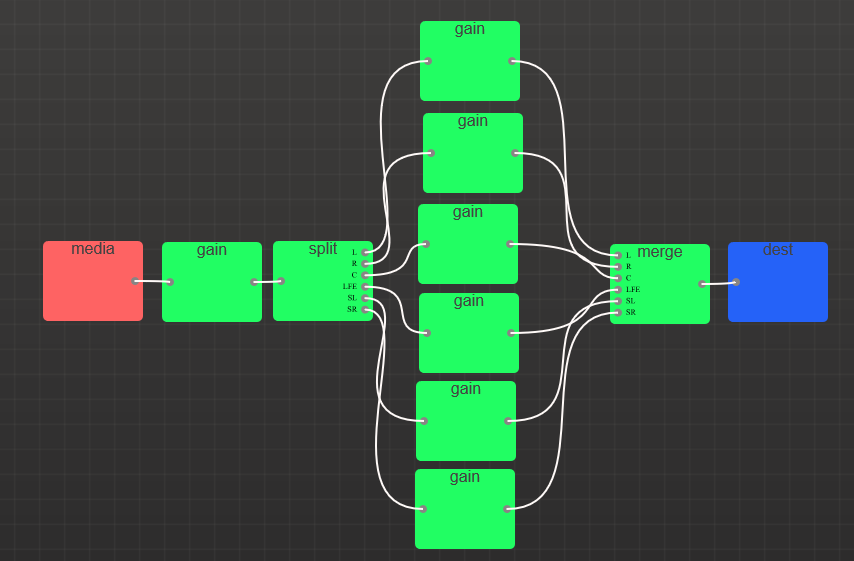

# Using Web Audio API to enable and disable individual Audio Channels based on Video

https://jenglamlow.github.io/sample-audio-channel-control/

### Block Diagram

Draw using [Web Audio Composer](https://tai2.net/docs/webaudiocomposer/)